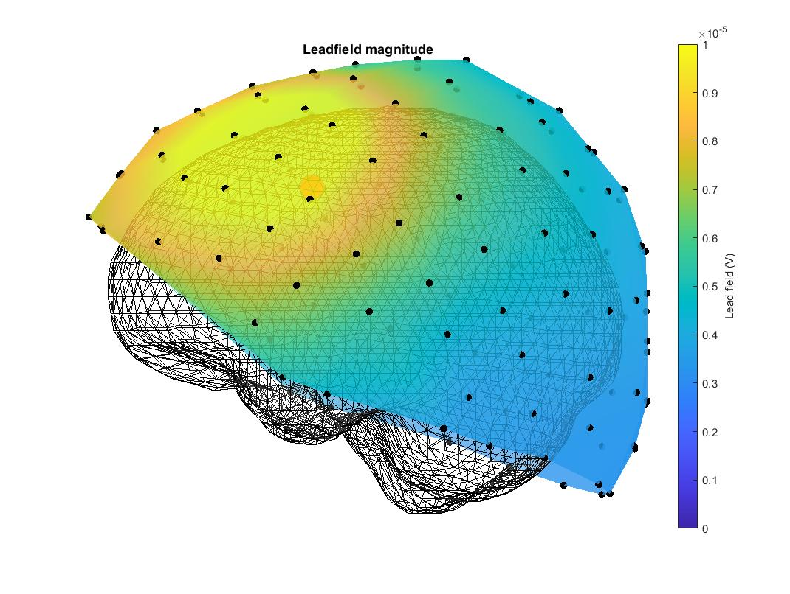
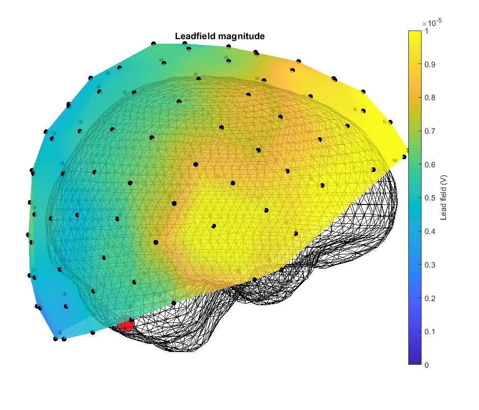
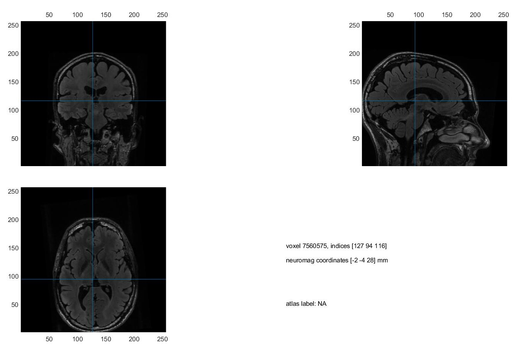
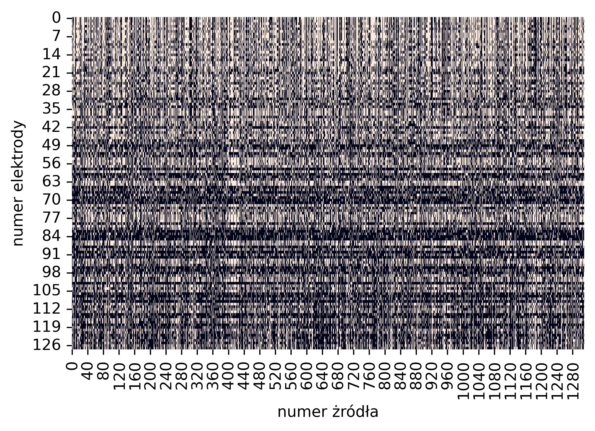

# DSNMF
Implementation of deep semi non-negative matrix factorization for leadfield matrix analysis in EEG. It is a part of my engineering thesis project based on 2015 paper "A deep matrix  factorization method for learning attribute representations" by G. Trigeorgis, K. Bousmalis, S. Zafeiriou and B. W. Schuller

Abstract:
>"Deep matrix factorization (DMF) is a method for extracting hierarchical, latent features of a dataset. In this work we propose a new strategy for analysis of leadfield matrices
used in electroencephalography (EEG), with the goal of finding a method for clustering
electrical sources and electrodes similar to each other with respect to the electric field
generated by said sources. We show that DMF is an effective method for decomposition
of a leadfield matrix and that resulting representation lends itself to clustering according
to its hidden attributes."

Pseudocode of the DSNMF below.

Leadfield for 1 source    |  one of the clusters visualized
:-------------------------:|:-------------------------:
   | 

mri scan for voxel shape   |  similarity of sources with respect to sensors (1 cluster)
:-------------------------:|:-------------------------:
   | 

Pseudocode of the DSNMF:

>INPUT:\
{\
$M^{m \times n}$ - leadfield matrix,\
$L$ - number of layers in the final network,\
$E_{1 \times L}$ - number of epochs for each layer,\
$E_{u}$ - number of epochs for deep learning,\
$\epsilon$ - acceptable error\
}
>
>OUTPUT: &nbsp;
$P_{1 \times L+1}$ - vector containing resulting matrices
>
>1. INITIAL DECOMPOSITION
>  * $temp \gets M$
>  * __For__ ($i$ from 0 to $L$)
>    * init matrices $Z^{m \times m}$ and $H^{m \times n}$ with random values
>    * __For__ ($j$ from 0 to $E_L$)
>      * $M_{pred} \gets Z * H$
>      * $l \gets \sum_{j}^{m} \sum_{i}^{n} (M_{i,j} - M_{pred(i,j)})^2$
>      * calculate gradients
>      * optimizer step
>      * $H \gets H^{+}$
>    * $P_{L} \gets Z$
>    * $temp \gets H$
>  * $P_{L+1} \gets H$
>
>2. DEEP LEARNING FOR FEATURES
>  * __For__ ($i$ from 0 to $E_u$)
>    * $M_{pred} \gets \Pi_{j=0}^{L+1} (P_{j})$
>    * $l \gets \sum_{j}^{m} \sum_{i}^{n} (M_{i,j} - M_{pred(i,j)})^2$
>    * calculate gradients
>    * optimizer step
>    * $P_{L+1} \gets P_{L+1}^{+}$
>    * __If__ ($l < \epsilon$)
>      * break

Pseudocode of the clustering step:

>INPUT:\
>{\
>$H^{m \times n}$ – latent features matrix,\
>$M^{m \times n}$ – leadfield matrix,\
>$c$ – desired number of clusters\
>}\
>OUTPUT: &nbsp;
$M_C$ - partial matrices recreated from clusters
>1. CLUSTERING
>  * $h \gets vec(H)$
>  * $h \gets h / ||h||$
>  * For (each element in $h$)
>    * $h_{i} \gets (1, h_{i})$
>  * $c_{labels} \gets$ k-means on $h$ for $c$ clusters, -label vector $(1, m*n)$
>  * $c_{labels} \gets vec_{m \times n}^{-1} (c_{labels})$
>  * __For__ (each cluster label $c$ in $c_{labels}$)
>    * $M_C \gets \Theta^{m \times n}$
>    * __For__ (each row $i$ in $c_{labels}$)
>      * __For__ (each column $j$ in $c_{labels}$)
>        * __If__ ($C_{labels(i,j)} = c$)
>          * $M_{C(i,j)} \gets M_{i,j}$
>    * Save $M_C$ in .csv file